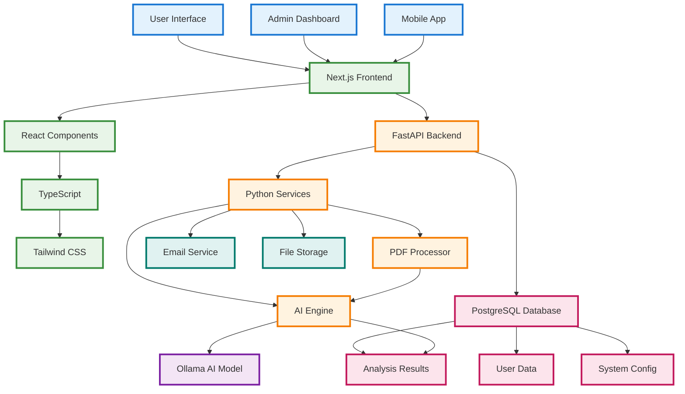
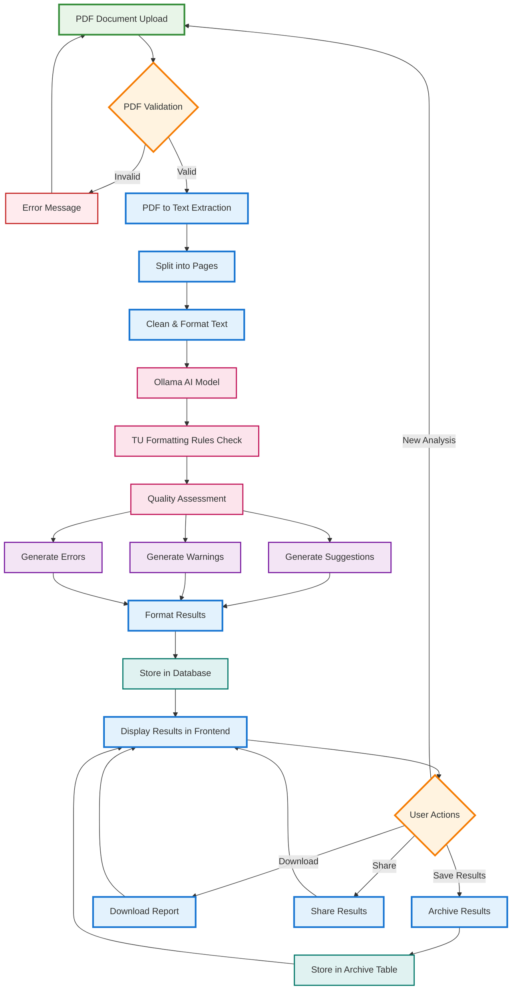

# TU Project Report Checker - System Architecture

## System Overview
This is a comprehensive system for analyzing and checking TU (Tribhuvan University) project reports using AI-powered analysis.

## Simple Block Diagram



## PDF Processing Flow - Block Diagram Style



## Alternative Text-Based Block Diagram

```
┌─────────────────────────────────────────────────────────────────┐
│                    INPUT STAGE                                 │
├─────────────────┬─────────────────┬───────────────────────────┤
│  PDF Upload     │  File Validation│   Server Storage          │
└─────────┬───────┴─────────┬───────┴─────────────┬─────────────┘
          │                 │                     │
          ▼                 ▼                     ▼
┌─────────────────────────────────────────────────────────────────┐
│                  PROCESSING STAGE                              │
├─────────────────┬─────────────────┬───────────────────────────┤
│  Text Extract   │  Page Splitting │   Text Cleaning           │
├─────────────────┼─────────────────┼───────────────────────────┤
│  Structure Analysis│ Content ID   │   Format Preparation      │
└─────────────────┴─────────────────┴───────────────────────────┘
                                │
                                ▼
┌─────────────────────────────────────────────────────────────────┐
│                    AI ANALYSIS STAGE                           │
├─────────────────┬─────────────────┬───────────────────────────┤
│  Ollama AI      │  TU Rules Check │   Quality Assessment      │
├─────────────────┼─────────────────┼───────────────────────────┤
│  Issue Detection│  Suggestion Gen │   Error Identification     │
└─────────────────┴─────────────────┴───────────────────────────┘
                                │
                                ▼
┌─────────────────────────────────────────────────────────────────┐
│                    OUTPUT STAGE                                │
├─────────────────┬─────────────────┬───────────────────────────┤
│  Result Format  │  Database Store │   Frontend Display        │
├─────────────────┼─────────────────┼───────────────────────────┤
│  User Actions   │  Archive Save   │   Download/Share          │
└─────────────────┴─────────────────┴───────────────────────────┘
```

## Detailed PDF Processing Steps

### **📤 Phase 1: PDF Upload & Validation**
```
User Interface → File Upload Component → File Validation → Server Storage
```
1. **File Selection**: User drags & drops or selects PDF file
2. **Frontend Validation**: Check file type, size, and format
3. **Backend Validation**: Server-side security checks
4. **File Storage**: Save PDF to secure server location

### **🔍 Phase 2: Text Extraction & Processing**
```
PDF File → Text Extraction Service → Page Splitting → Text Cleaning
```
1. **PDF Reading**: Use PyPDF2 or similar library to read PDF
2. **Page Extraction**: Extract text from each page individually
3. **Text Cleaning**: Remove formatting artifacts, normalize spacing
4. **Structure Analysis**: Identify headers, sections, and content types

### **🤖 Phase 3: AI Analysis & Processing**
```
Cleaned Text → Ollama AI Model → TU Rules Check → Quality Assessment
```
1. **Content Preparation**: Format text for AI model input
2. **AI Processing**: Send to Ollama local LLM
3. **Rules Checking**: Compare against TU formatting standards
4. **Issue Detection**: Identify problems and areas for improvement
5. **Suggestion Generation**: Create actionable recommendations

### **📊 Phase 4: Results Generation & Categorization**
```
AI Analysis → Result Categorization → Formatting → Database Storage
```
1. **Result Categorization**: Sort into Suggestions, Warnings, Errors
2. **Data Formatting**: Structure results for user display
3. **Database Storage**: Save analysis results with metadata
4. **User Interface**: Display results in organized categories

### **💾 Phase 5: User Experience & Actions**
```
Results Display → User Actions → Archive/Download/Share → Dashboard
```
1. **Results Display**: Show categorized analysis results
2. **User Actions**: Allow saving, downloading, or sharing
3. **Archive Storage**: Store results for future reference
4. **Return to Dashboard**: Ready for next analysis

## PDF Processing Technical Details

### **🔧 Backend Services Used**
- **PDF Reader**: `PyPDF2` or `pdfplumber` for text extraction
- **Text Processing**: `re` (regex) for text cleaning
- **AI Integration**: Custom Ollama client for analysis
- **Database**: PostgreSQL with SQLAlchemy ORM
- **File Storage**: Local server storage with cleanup

### **⚡ Processing Performance**
- **Text Extraction**: ~2-5 seconds per page
- **AI Analysis**: ~10-30 seconds depending on content length
- **Total Processing**: ~1-3 minutes for typical reports
- **Real-time Updates**: Progress indicators during processing

### **🛡️ Security & Validation**
- **File Type Check**: Only PDF files accepted
- **Size Limits**: Maximum file size restrictions
- **Virus Scanning**: Basic malware protection
- **Content Validation**: Check for readable text content
- **User Authentication**: Secure access to uploaded files

### **📱 User Experience Features**
- **Progress Bar**: Real-time processing status
- **Error Handling**: Clear error messages for invalid files
- **Result Preview**: Quick overview before detailed analysis
- **Download Options**: PDF reports with analysis results
- **Archive Access**: Retrieve previous analysis results

## Alternative Text-Based PDF Flow

```
┌─────────────────────────────────────────────────────────────────┐
│                    PDF UPLOAD PHASE                            │
├─────────────────┬─────────────────┬───────────────────────────┤
│  File Selection │  Drag & Drop    │   Browse Files            │
├─────────────────┼─────────────────┼───────────────────────────┤
│  File Validation│  Size Check     │   Type Verification       │
└─────────────────┴─────────────────┴───────────────────────────┘
                                │
                                ▼
┌─────────────────────────────────────────────────────────────────┐
│                  TEXT EXTRACTION PHASE                         │
├─────────────────┬─────────────────┬───────────────────────────┤
│   PDF Reading   │  Page Splitting │   Text Extraction         │
├─────────────────┼─────────────────┼───────────────────────────┤
│  Text Cleaning  │  Structure Analysis│ Content Identification │
└─────────────────┴─────────────────┴───────────────────────────┘
                                │
                                ▼
┌─────────────────────────────────────────────────────────────────┐
│                    AI ANALYSIS PHASE                           │
├─────────────────┬─────────────────┬───────────────────────────┤
│  Content Prep   │  Ollama AI      │   TU Rules Check          │
├─────────────────┼─────────────────┼───────────────────────────┤
│ Quality Assessment│ Issue Detection│ Suggestion Generation     │
└─────────────────┴─────────────────┴───────────────────────────┘
                                │
                                ▼
┌─────────────────────────────────────────────────────────────────┐
│                  RESULTS GENERATION                            │
├─────────────────┬─────────────────┬───────────────────────────┤
│  Categorization │  Data Formatting│   Database Storage        │
├─────────────────┼─────────────────┼───────────────────────────┤
│  User Display   │  Action Options │   Archive Management      │
└─────────────────┴─────────────────┴───────────────────────────┘
```

This detailed flow shows exactly how your PDF moves through the system, from the moment it's uploaded until the user receives their analysis results!
